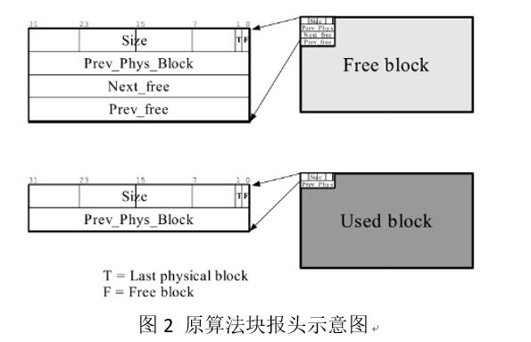
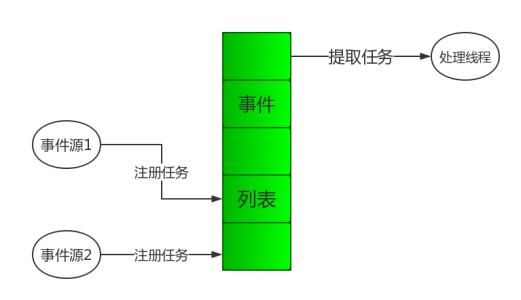

<h1 style="color:red;align:center"> Amazon-FreeRTOS 可行性报告 </h1>

<span style="align:center;color:blue"><b>作者：邓浩巍，方宇辰，王梓涵，朱河勤（字典序）</b></span>

<br>

>在经过充分调研后，我们对 Amazon-FreeRTOS 有了足够的了解。下面进行可行性分析。
分为几个方面：组员的能力，项目的内容(包括内存管理,任务调度等),创新点(引入协程)

# 能力分析

## 程序语言
我们决定用 C 语言完成我们的项目代码部分。一个原因是现有的嵌入式系统大多是 c 语言实现的，有很多资料，经验可以学习，借鉴。

另外，C 语言有很多优点，比如：简洁紧凑、速度极快，是一门结构式语言，还可以允许直接访问物理地址，可以直接对硬件进行操作
因此既具有高级语言的功能，又具有低级语言的许多功能，能够象汇编语言一样对位、字节和地址进行操作，非常适合写系统软件。
C 语言有一个突出的优点就是适合于多种操作系统，如 DOS、UNIX, 也适用于多种机型。

加之我们都学习过 C 语言，都还算熟悉。可以灵活运用。
### 看过一些提高的教程，如
* `C 与指针`
* `C 专家编程`
* `accelerate c++`
* ...
### 练习过很多项目
* `huffman 压缩解压缩`
* `模拟银行`
* `路径搜索`
* ...

我们组的成员都能用 c 语言写出一些项目，不像其他组用 rust, 要花额外的时间来学习。
这样我们就能将精力放在优化，提高 Amazon-FreeRTOS 在微控制器上的性能，作出更多的创新性工作。

## 资料
关于嵌入式操作系统的资料比较多，虽然有质量的论文，资料是英文的，但是我们组的一些同学英语水平较高，读英文 paper 的能力较强。

Amazon-FreeRTOS 还有专门的用户手册，开发指南等等。更进一步的，Amazon-FreeRTOS 是开源的，我们可以得到它的源码。

这些都可以让我们快速地学习 free-RTOS,  掌握一个嵌入式系统的知识与构建过程，逐步改进，完善嵌入式操作系统 free-RTOS 的功能。

## 算法与数据结构

我们小组的成员都上过数据结构课，并且课外还练习过其他算法，如各种排序算法，实现过其他高级数据结构，比如 splay tree, trie 等，
所以实现，改进，创新性地颠覆一个在某些领域更合适的算法或者是数据结构是一件可以期望的事。经过我们长时间，认真的调研，
我们初步发现了 Amazon-FreeRTOS 的一些地方，尤其是内存管理，资源调度方面是值得改进的，这也是我们项目的重点。我们有能力做出进一步的工作与成果。


# 项目分析

## 项目定位
Amazon FreeRTOS 还存在需要优化的地方，我们的项目工作主要放在功耗、内存、连接性、安全性等方面。
并在某个特定的领域 -- 微型控制器上做出相应的优化工作。

>这是实用的。

目前有很多微小的设备都需要微型控制器实现精确控制。随着物联网的发展，可以预见将来的趋势：嵌入式系统将更加实用，热门。

>这是可行的

Amazon-FreeRTOS 源代码相对较少，内核精简，对于我们来说，有时间，有精力，有能力完成。

## 实现内容
 我们目前已经熟悉了 Amazon-FreeRTOS 的内存调度算法，发现简单的算法无法达到要求，能达到要求的算法较为复杂，在硬件上实现颇有难度。
 我们小组经过多次讨论与探究，决定精简一部分，实现在某些领域更实用，可靠的 Amazon-FreeRTOS 版本。

### FreeRTOS 内存管理优化的可行性分析
理论依据<br>
FreeRTOS 现有的内存管理策略主要有一下问题：<br>

>时间确定性不强

对于已有的 heap_1 至 heap_5 五种策略，只有 heap_1 能在 O(1) 时间内完成内存分配工作，但是 heap_1 没有释放功能。对于 heap_2 至 heap_5，由于没有索引，只有一个简单的链表管理未分配空间，每当应用请求空间时都需要顺序查找链表，无法做到固定时间的存取，不利于系统的实时性。
	对于碎片的处理不够有效
目前只有 heap_4 与 heap_5 有针对碎片进行的处理，所进行的操作仅仅是把相邻的空闲块合并。在小内存设备中对碎片的可以进一步优化。
针对以上问题，在新算法 TLSF 中，采取位图与链表相结合的方式对内存池进行管理，结合了两者的有点，即速度快、碎片少。
TLSF 算法使用隔离适应机制实现了一个最佳适应策略，原算法针对 4G 内存设计，即 32 位地址。为了加速访问空闲块同时管理一大组隔离链表，链表数组被分为两级管理。第一级将空闲内存块划分为若干个个区间，称为 FLI（First-level Segregated Fit）。第二级别 SLI（Second-level Segregated Fit）把第一级线性划分为 2SLI 个区间（SLI 是一个用户可配置参数）。两个级别各对应一个位图，用来标记对应内存是否为空，如果不空则有一个指针指向内存块，否则为空。
为了更快地合并空闲块，TLSF 算法在每个内存块前面添加一小块“内存块报头”(block header)。对于空闲块，报头中含有块大小、物理上的前一块地址、前一个和后一个空闲块地址；对于已使用块，报头中含有块大小、物理上的前一块地址。因此每个空闲内存块被两个链表连接：1) 隔离链表：对应 SLI，将同一类的内存块连接起来和 2) 由物理地址排序的链表。这样只要给出某一内存块在第一、二级中的位置，通过连续两个指针可以直接访问到对应报头得到所有信息，如下图 1 所示。


为了实现 O(1) 时间的内存分配和回收，TLSF 使用 segregate list() 函数确定需求内存块位置。在第一级 FLI 中，内存区间按 2 的次幂排序，因此若用 mapping (size) → (f, s) 表示对应块在第一、二级数组中的位置，f =⌊log_2  (size)⌋  ，s=(size-2^f)2^SLI/2^f 。
如果用上式找到了空闲内存，则返回，若无法找到，则找下一个比需求大的内存块。此操作由于采用位图搜索算法时间复杂度也为 O(1)。
释放内存的方式和上述过程基本相同，先计算 f 与 s，然后利用报头中的信息合并相邻空闲空间。

### 技术依据

针对 FreeRTOS 的 64KB 的内存，需要对 TLSF 算法做一定的改进。具体来说，对于报头，64K 内存只有 16 位地址，因此报头中每个数据都为 16 位。另外，由于数据通常以 4B 为单位 (word)，大小数据实际上只需要 14 位，余下两位作为标志位，分别标记是否为空闲块和是否为物理上的最后一块，如下图。



根据 TLSF 算法，可以简单写出 malloc 时的伪代码如下。

```c
void *malloc(size){
	int fl, sl, fl2, sl2;
	void *found_block, *remaining_block;
	mapping (size, &fl, &sl); 	// O(1)，计算 f 与 s
	found_block=search_suitable_block(size,fl,sl);// O(1)，根据 f,s 搜索合适块
	remove (found_block); 	// O(1)，从链表移除即将分配的块
	if (sizeof(found_block)>size) {	// 如果大小不是完全相等
		remaining_block = split (found_block, size);	// 将当前块分成两块
		mapping (sizeof(remaining_block),&fl2,&sl2);	// 计算未使用块的 f 与 s
		insert (remaining_block, fl2, sl2); 	// O(1)，根据 f,s 将剩余块加入链表
	}
	return found_block;
}

//free 函数伪代码如下。

void free(block){
   int fl, sl;
   void *big_free_block;
   big_free_block = merge(block); // O(1)，块合并
   mapping (sizeof(big_free_block), &fl, &sl);
   insert (big_free_block, fl, sl); // O(1)
}
```
对于具体变量的数据类型，可以根据 FreeRTOS 内核的定义进行适当的修改。FreeRTOS 的数据类型更为细致，可以使用 16 位变量保存块报头的数据，s 与 l 可以使用 8 位变量，压缩花费空间。
以 64K 存储为例，存储二维数组及位图需要不到 100B 的空间，对于每一个内存块，报头需要占用 8B。这对于需要多次申请小空间的应用来说显然开销很大，但是对于稍大的内存申请来说可以接受。另外由于有合并策略，多个连续小内存块的报头在多次释放后不会一直存在，不会造成浪费。
针对 TLSF 算法，已经有多个实验。TLSF 在面对 First-Fit, Best-Fit, Douglas Lea’s malloc,
Binary Buddy 四个算法的效果表 1。


其中加粗项为针对对应算法的最坏情况，表中数据单位为时钟周期。从数据可见 TLSF 算法相比于其他算法稳定性极强，对于各种情况所花费时间最为稳定。

创新点
相比于现有策略，新算法可以明显 FreeRTOS 的实时性，并把额外内存消耗控制在可以接受的范围之内。
对于碎片有一定的优化。

### 任务调度
 Amazon 开发 FreeRTOS 主要将其用于对传感器的微控制器中，许多传感器工作的特点硬实时需求高，但是只是对部分优先度极高的任务，并且当今传感器分工明确，大部分时候需要执行的任务是由少部分优先度极高，以及大部分需要长时间运行的任务组成。比如烟雾报警器，报警为优先度最高且必须硬实时执行，此外 Amazon 还给自己的传感器添加了往云端传输数据的任务。由于需要不断将传感器收集到的数据传到云端，传感器内必须要长时间运行该进程。但是该进程的优先度实际不高，甚至不一定需要保证每时每刻工作，因此在任务调度将进程调出内存时，可以考虑直接销毁该进程，工作结束后重新调入。此外，为了减小最大内存，需要进一步精简优先度高且硬实时需求高的任务所需要的内存，部分其他任务调离内存时可以考虑用传输的方式传递到其他芯片上储存，节省本地的空间。<br>
 因此我们的打算修改 Amazon FreeRTOS 的代码，将任务抽调出内存的部分进行修改，比对上述两种方法的优劣性以选择最合适的一种，或者将两者结合，部分任务直接销毁，部分任务传递到其他芯片存储。

### 外围通讯库的改写


# 协程(coroutine)
## 协程的定义
协程是通过允许多入口的停止与唤醒执行任务来产生子程序实现非抢占式多任务的计算机程序组件.[^1]
子例程一般被认为是某个主程序的一部分代码,该代码执行特定的任务并且与主程序中的其他代码相对独立.

## 协程的由来
我们知道,进程是资源分配的单位. 进程的出现是为了更好的利用CPU资源使得并发成为可能.
为了实现并发,出现多进程的概念. 然而进程的上下文切换开销较大,于是出现了线程.
线程共享进程的大部分资源(比如文件),只有少数是独立拥有的,比如堆栈(实现函数调用,局部变量保存等功能),  寄存器.

这样就大大减少了开销.突破了一个进程只能做一件事的缺点.

然而,当涉及大规模的并发连接时,比如10k连接, 以线程作为处理单元, 系统调度的开销还是过大. 系统可能处于:
```
当连接数很多 —> 
需要大量的线程来干活 —> 
可能大部分的线程处于 ready 状态 —> 
系统会不断地进行上下文切换。
```

既然性能瓶颈在上下文切换，那解决思路也就有了，在线程中自己实现调度，不陷入内核级别的上下文切换。这就是协程的功能

## 优势比较
最大的优势就是协程极高的执行效率。因为子程序切换不是线程切换，而是由程序自身控制，因此，没有线程切换的开销，和多线程比，线程数量越多，协程的性能优势就越明显。
第二大优势就是不需要多线程的锁机制，因为只有一个线程，也不存在同时写变量冲突，在协程中控制共享资源不加锁，只需要判断状态就好了，所以执行效率比多线程高很多。
因为协程是一个线程执行，那怎么利用多核 CPU 呢？最简单的方法是多进程 + 协程，既充分利用多核，又充分发挥协程的高效率，可获得极高的性能。

与子例程比较,协程可以返回多次, 自己掌握控制流,在需要的地方挂起与恢复. 而子例程一旦开始,就一直执行到返回,值返回一次.
并且协程具有状态,每一次唤醒可能具有不同的结果.

## 举例说明
一个生产者与消费者的例子如下,来自wiki[^1]

```伪代码
var q := new queue

coroutine produce
    loop
        while q is not full
            create some new items
            add the items to q
        yield to consume

coroutine consume
    loop
        while q is not empty
            remove some items from q
            use the items
        yield to produce
```

可以用python实现如下:
```python  consumer-producer

que=[]

def consumer():
    msg ='I am begin to consume'
    while 1:
        t = yield msg
        print("@ Consumer recerived sig '{}'".format(t))
        msg = 'Consumer has handled {}'.format(que)
        if t=='begin':
            while que:que.pop()
        elif t == 'end':return 'Finish all work'
        else:msg  = "Consumer doesn't know what '{}' means".format(t)

def producer(csm,n=4):
    csm.__next__()
    ct=0
    global que
    while True:
        while len(que)<4:
            que.append(ct)
            ct+=1
        sig=''
        if ct<12:sig = 'begin'
        elif ct<13 :
            que=[]
            sig = 'hello'
        else : sig ='end'
        try:
            fd = csm.send(sig)
            print("# Producer got feed back: {}".format(fd))
        except StopIteration as e:
            print(e)
            return 

if __name__ =='__main__':
    csm = consumer()
    producer(csm)
```

这是执行结果


>`解释`

有一个全局的队列,生产者通将任务放到队列中知道队列元素达到一定数目,然后发送信号(可以有不同的信号,对应不同的意义),
通知消费者来处理, 然后转移程序控制权.
消费者通过接收到的信号实现对应的操作, 如下图所示




